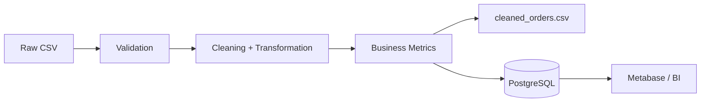

# Python Data Pipeline

[](https://github.com/kauadev77/data-pipeline-python/actions/workflows/ci.yml)


[](LICENSE)

A portfolio-safe **data engineering and analytics pipeline** built with Python, Pandas, NumPy and PostgreSQL-ready outputs.

The project simulates an e-commerce order flow using fictional data, validates the dataset, transforms records, calculates business metrics and prepares analytics-ready outputs for PostgreSQL and BI tools such as Metabase.

## What this demonstrates

- ETL pipeline design
- Data validation and cleaning
- Pandas transformations
- NumPy-based derived metrics
- SQL analytics
- PostgreSQL-ready schema design
- Automated tests with pytest
- Docker Compose for local PostgreSQL
- CI with GitHub Actions
- Safe use of fictional portfolio data

## Architecture



## Project structure

```text
.
├── data/
│   └── orders.csv
├── src/
│   └── pipeline.py
├── sql/
│   ├── schema.sql
│   └── analytics.sql
├── tests/
│   └── test_pipeline.py
├── .github/workflows/ci.yml
├── .env.example
├── docker-compose.yml
├── requirements.txt
└── README.md
```

## Run locally

```bash
python -m venv .venv
source .venv/bin/activate  # Windows: .venv\Scripts\activate
pip install -r requirements.txt
python src/pipeline.py
```

The pipeline creates `data/cleaned_orders.csv`.

## Tests

```bash
pytest
```

## PostgreSQL

```bash
docker compose up -d
```

The repository includes:

- `sql/schema.sql` for the target table
- `sql/analytics.sql` with sample analytical queries

## Example metrics

The pipeline calculates:

- number of orders
- total gross value
- recognized revenue
- average paid order value

## Metabase

The SQL queries can be used as a starting point for dashboards such as:

- revenue by month
- top products by revenue
- order-status distribution

## Portfolio safety

All records are fictional. No company data, customer information or proprietary production code is used.

## License

MIT
